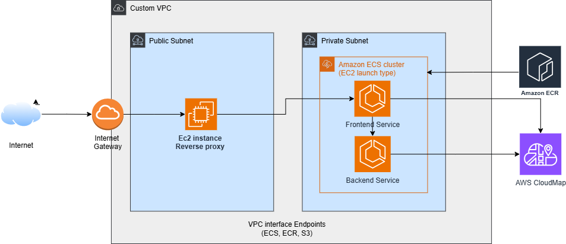

# Production-Style Full-Stack Deployment on AWS (ECS EC2)

## Architecture Diagram

## Overview

This project demonstrates a production-style microservices architecture built on AWS using Amazon ECS (EC2 launch type).

The system consists of:

- Frontend (NGINX container serving static content)
- Backend (Flask API)
- Private networking using VPC
- Service discovery using AWS Cloud Map
- Reverse proxy layer using NGINX (public EC2)

---

## Architecture Design

Internet  
→ NGINX EC2 (Public Subnet)  
→ Frontend ECS Service (Private Subnet)  
→ Backend ECS Service (Private Subnet)

Both frontend and backend services are fully private and not directly accessible from the internet.

---

## Key AWS Services Used

- Amazon ECS (EC2 Launch Type)
- Amazon ECR
- AWS Cloud Map
- EC2 (NGINX reverse proxy)
- Auto Scaling Groups
- ECS Capacity Providers
- VPC (Public + Private Subnets)
- VPC Interface Endpoints (ECS, ECR, S3)

---

## Networking & Security

- awsvpc network mode (each task gets its own ENI)
- Security group chaining:
  - NGINX → allows HTTP from internet
  - Frontend → allows traffic only from NGINX SG
  - Backend → allows traffic only from Frontend SG
- No NAT Gateway (cost optimized)
- Internal service communication via private DNS

---

## Reverse Proxy Routing

NGINX routes:

- `/` → frontend.internal
- `/api/` → backend.internal

Cloud Map enables dynamic DNS resolution for scaling.

---

## Production Concepts Demonstrated

- Network isolation
- Container orchestration with ECS
- Private image storage in ECR
- Centralized ingress control
- Service discovery
- Scalable microservices communication
- Cost optimization without NAT Gateway
